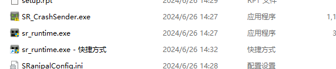
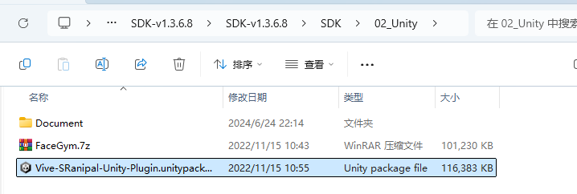
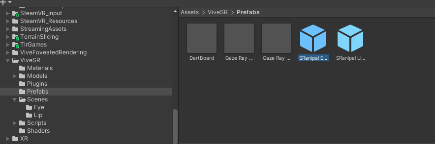
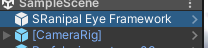
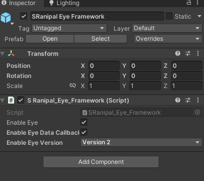

# 说明
## 前期准备
1. SRanipaRuntime SDK（VIVE Eye and Facial Tracking SDK）：
   
   下载地址：https://developer-express.vive.com/resources/vive-sense/eye-and-facial-tracking-sdk/download/latest/

2. SR_runtime 软件：
   
   steam 搜索 VIVE Console for SteamVR，下载该软件。
   安装好软件后，在该软件安装目录下的`\common\VIVEDriver\App\SRanipal` 位置可以找到SR_runtime：
   
   

## 使用：
1. Unity 中导入 SDK：
   
   在 Unity 项目中 import 下图的 package 文件
   
   

3. `Asset` 目录下多出一个 `ViveSR` 文件夹，要在自己的场景中使用，需要将该文件夹下的 SRanipal Eye Framework 预制体加入到场景中。
   
   

4. 将 `EyeDataCollect.cs` 文件挂载在 vr 相机上，如果需要获取碰撞体位置，可以参考Assets/Scripts/EyeDataSave.cs文件。
